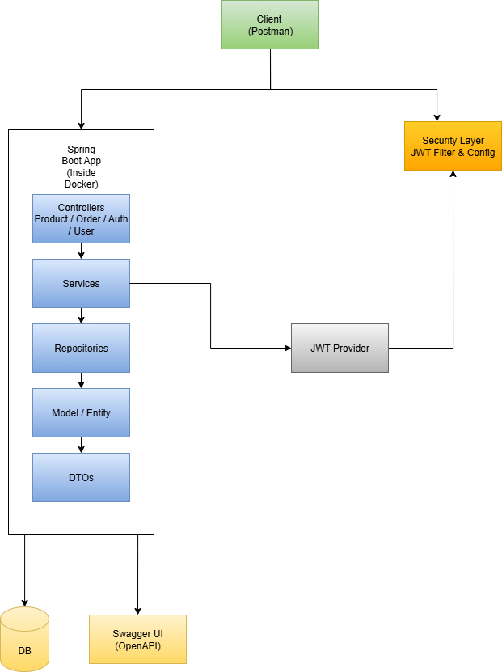

🛒 E-Ticaret API Projesi

Bu proje, Spring Boot kullanılarak geliştirilmiş, temel bir e-ticaret uygulamasının RESTful API'sidir. Ürün yönetimi, sipariş işlemleri ve kullanıcı kimlik doğrulama/yetkilendirme gibi temel e-ticaret fonksiyonelliklerini sağlar.

🚀 Teknolojiler
- Java 23
- Spring Boot 3.2.5
- Spring Web
- Spring Data JPA
- Spring Security (JWT tabanlı)
- Spring Validation
- Hibernate
- H2 Database (in-memory, dev/test için)
- Lombok
- JJWT (JWT işlemleri için)
- Springdoc OpenAPI (Swagger UI)
- Maven
- JUnit 5 & MockMvc
- Docker

🏗️ Mimari

Proje, SOLID ve temiz kod prensiplerine uygun olarak katmanlı mimari ile tasarlanmıştır:

🔹 Controller Katmanı
- HTTP isteklerini alır, DTO'lar üzerinden verileri işler.
- Servis katmanına yönlendirir, HTTP yanıtı döner.

🔹 Service Katmanı
- İş mantığı burada yer alır.
- Controller'dan gelen istekleri işler, Repository katmanı ile çalışır.
- Transaction yönetimi buradadır.

🔹 Repository Katmanı
- Veritabanı işlemlerini gerçekleştirir.
- Spring Data JPA sayesinde CRUD işlemleri otomatikleştirilir.

🔹 Model / Entity Katmanı
- JPA Entity'lerini içerir (veritabanı tabloları).

🔹 DTO (Data Transfer Object) Katmanı
- Katmanlar arasında veri taşır.
- Hassas verilerin dışa açılmasını engeller.

✨ Özellikler ve API Endpoint’leri

📦 Ürün İşlemleri (/api/v1/products)
- GET /: Tüm ürünleri listeler (sayfalama + sıralama destekli)
- GET /{id}: Belirli ürünü getirir
- POST /: Yeni ürün ekler (🔐 ADMIN)
- PUT /{id}: Ürünü günceller (🔐 ADMIN)
- DELETE /{id}: Ürünü siler (🔐 ADMIN)
- GET /category/{category}: Kategoriye göre ürün listeler
- PATCH /{id}/stock: Stok miktarını günceller (🔐 ADMIN)

🧾 Sipariş İşlemleri (/api/v1/orders)
- POST /: Yeni sipariş oluşturur (🔐 USER / ADMIN)
- GET /{id}: Sipariş detaylarını getirir (🔐 Kullanıcı kendi, admin hepsini)
- GET /user/{username}: Kullanıcıya ait siparişleri listeler (🔐 Kullanıcı kendi, admin hepsini)
- PUT /{id}/status: Sipariş durumunu günceller (🔐 ADMIN)
- DELETE /{id}: Siparişi iptal eder (stok geri eklenir) (🔐 USER / ADMIN)
- DELETE /{id}/admin: Siparişi tamamen siler (🔐 ADMIN)

👤 Kullanıcı İşlemleri (/api/v1/auth, /api/v1/users)
- POST /auth/register: Yeni kullanıcı kaydı
- POST /auth/login: Giriş yapar, JWT döner
- GET /users/profile: Kullanıcı profili (🔐 Giriş yapılmış kullanıcı)
- PUT /users/profile: Profili günceller (🔐 Giriş yapılmış kullanıcı)
- POST /users/address: Adres ekler (🔐 Giriş yapılmış kullanıcı)

⚙️ Kurulum ve Çalıştırma

✅ Ön Koşullar
- Java 23 JDK
- Maven
- Docker (isteğe bağlı)
- Git

📥 Projeyi Klonlayın
git clone <proje_depo_url_buraya>
cd ecommerce

📦 Bağımlılıkları Yükleyin
mvn clean install

▶️ Uygulamayı Çalıştırın
mvn spring-boot:run
http://localhost:8080

🐳 Docker ile Çalıştırma (Opsiyonel)
docker build -t ecommerce-api .
docker run -p 8080:8080 ecommerce-api

🗄️ Veritabanı Erişimi (H2 Console)
http://localhost:8080/h2-console
- JDBC URL: jdbc:h2:mem:testdb
- Kullanıcı: sa
- Şifre: password

🔐 Güvenlik (JWT)
- JWT token POST /api/v1/auth/login ile alınır.
- Authorization header içinde gönderilmelidir:
  Authorization: Bearer <JWT_TOKEN>

📄 API Dokümantasyonu (Swagger UI)
http://localhost:8080/swagger-ui/index.html

🧪 Testler
- Unit Testler: Servis sınıfları (örnek: ProductServiceTest)
- Integration Testler: Controller + DB ile uçtan uca (örnek: OrderControllerIT)
- Testleri çalıştırmak için:
mvn test

✉️ İletişim

E-posta: emretek443@gmail.com

Emre Tek
